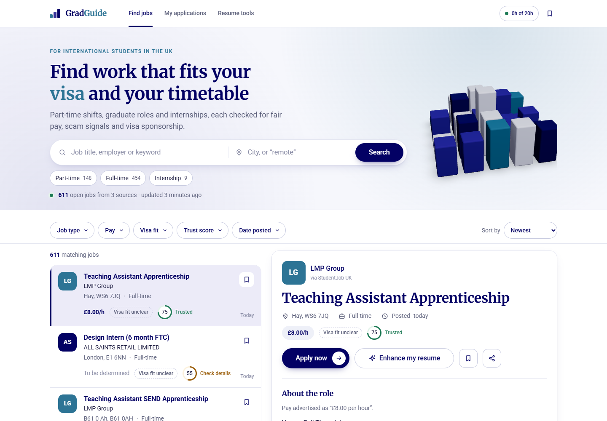
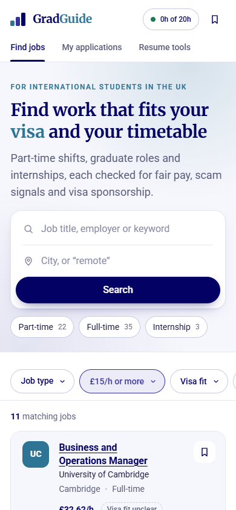
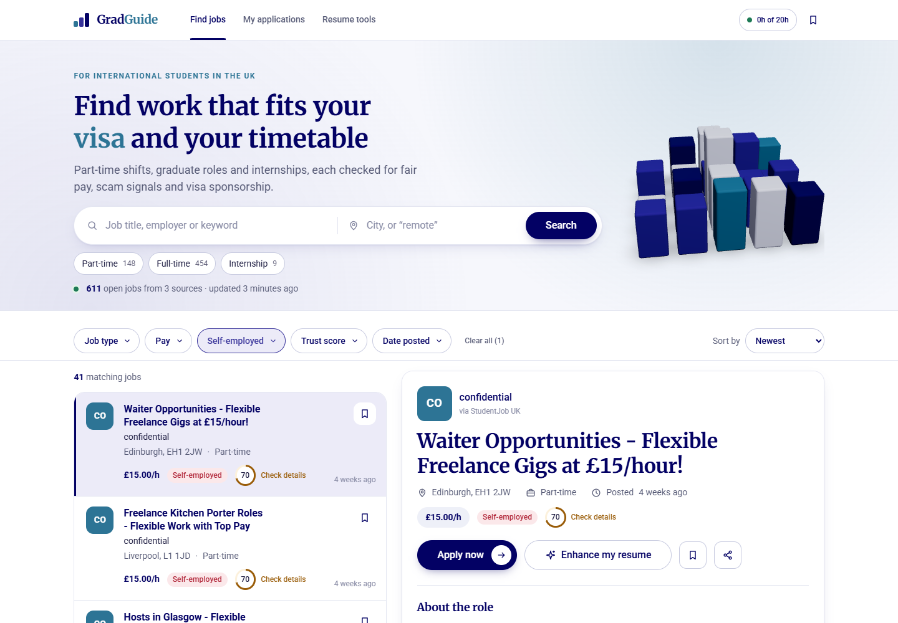
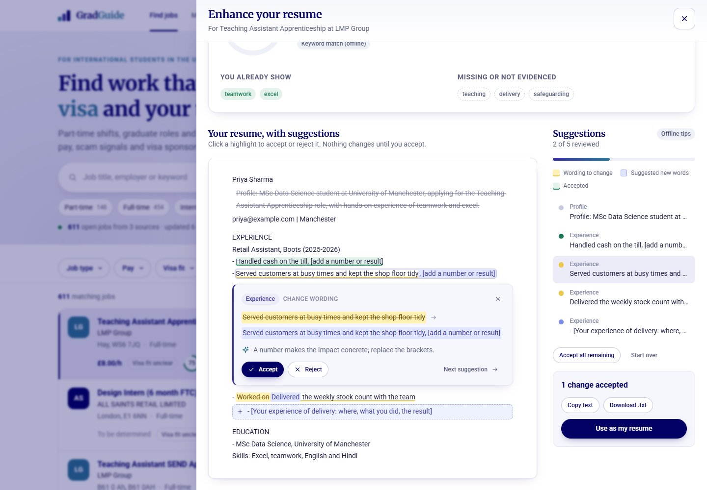
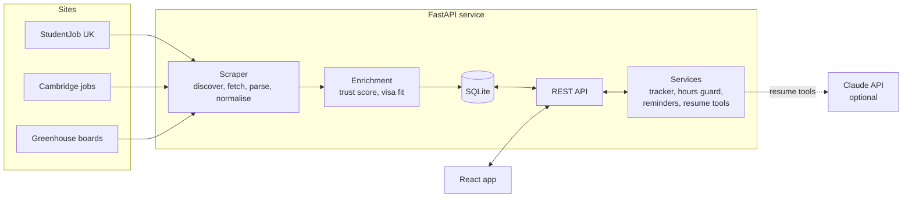

# GradGuide Jobs

A job discovery tool for international students in the UK: part-time and casual work,
graduate roles and internships, collected by **our own web scraper** and checked for the
things an international student needs to know: can I trust this advert, will it fit my
visa's work-hour limit, and how well does my resume fit?

- **Live app:** _add the Render URL here after deploying (see gradguide-jobs.onrender.com)
- **Video walkthrough:** _add the video link here_



## Contents

- [What it does](#what-it-does)
- [The three features](#the-three-features)
- [How the scraper works](#how-the-scraper-works)
- [Architecture](#architecture)
- [Run it locally](#run-it-locally)
- [Tests and code quality](#tests-and-code-quality)
- [Deployment](#deployment)
- [Project structure](#project-structure)
- [API](#api)
- [Known limitations](#known-limitations)

## What it does

| | |
|---|---|
| **Job coverage** | Part-time and casual (retail, bar and hospitality, delivery, tutoring), full-time and internships, about 600 open listings from 3 kinds of source |
| **Listing view** | Every listing shows title, employer, location, pay, job type and posted date, plus a trust score and a visa-fit tag |
| **Search and filters** | Keyword and location search; filters for job type, minimum pay, visa fit, trust score and date posted; sort by newest, pay or trust. Filters live in the URL, so searches can be shared and survive the back button |
| **Job page** | Apply on the employer's site (then mark it as applied in one click), save, share, see the trust breakdown and visa fit, or tailor your resume to the job |
| **Responsive** | Split list-and-detail view on desktop; full-page job view and bottom-sheet filters on phones |



## The three features

### 1. Trust score and visa fit

**Problem.** International students are targeted by fake jobs ("registration fee",
"WhatsApp only"), underpaid offers and adverts that quietly exclude them. They often can't
tell which is which, and a wrong choice can cost money or breach their visa.

**What it does.** Every listing gets a 0–100 trust score with the reasons listed worst
first:
- whether it was posted on the employer's own site or a third-party board;
- whether the pay is stated, or is below the minimum or Living Wage;
- scam phrases and inflated income claims;
- "ghost jobs" that stay up for weeks.

Each listing also gets a visa-fit tag: **student-friendly**, **visa sponsorship**, **needs
right to work**, **UK citizens only** or **self-employed**. The last one matters because
freelance work is not allowed on a Student visa at all, and 41 scraped listings were
exactly that.



### 2. Application tracker with a work-hour guard

**Problem.** A UK Student visa allows 20 hours of work a week in term time. Students
juggling several part-time offers can go over that without noticing, which can put their
visa at risk.

**What it does.**
- **Pipeline:** each job moves through saved → applied → interviewing → offered/closed.
- **Hours guard:** a 3D ring adds up the weekly hours of jobs at interview stage or
  beyond and warns before they pass the limit. You can pick your visa or set your own
  limit.
- **Reminders:** jobs that have been quiet for 7 days get a follow-up reminder with a
  ready-to-copy email.
- **Privacy:** every browser gets its own private tracker, with no account needed.

### 3. Resume match and line-by-line enhancement

**Problem.** Students often have the right experience but describe it in words that
screening software and recruiters do not match to the advert.

**What it does.**
- **Upload:** upload a PDF, Word or text resume. It is read in memory and never stored.
- **Fit score:** see which skills you already show and which are missing.
- **Suggested edits:** suggestions appear inside your resume. Yellow marks wording to
  change and blue marks new words. Accept or reject each one; nothing changes until you
  accept it.
- **Where suggestions come from:** Claude writes them when an API key is configured,
  rewriting your real bullets in the job's language without inventing facts. Without a
  key, built-in rules suggest stronger verbs, a missing number, a profile line built from
  your Education section, and the advert's wording for skills you already have.



## How the scraper works

The scraper is our own code: `requests` for fetching and BeautifulSoup for parsing. It
uses **no job-board APIs and no AI extraction** (Claude is only used for the resume
feature).

| Source | Site type | How it is read |
|---|---|---|
| **StudentJob UK** | Student job board | City and category result pages (5 cities, 11 everyday-job categories such as hospitality, cashier, delivery and teaching), then each job's detail page. JSON-LD `JobPosting` first, CSS selectors as fallback |
| **University of Cambridge** | Campus job board | A server-rendered table read with CSS selectors only |
| **Employer career boards on Greenhouse** (Deliveroo, Monzo, GoCardless, IMC) | Employers' own sites | The HTML board pages, UK roles only. Greenhouse's JSON API is deliberately not used |

**The pipeline:** discover pages → fetch politely → parse → normalise → score → store.

- **Polite fetching:**
  - waits 1.5–3.5 s between requests;
  - obeys robots.txt and its crawl delay;
  - backs off on 429/503 and respects `Retry-After`.

  It never rotates proxies or solves CAPTCHAs, and sites whose robots.txt blocks crawlers
  are left alone.
- **Robust parsing:** every field has several candidate selectors, so one change on a site
  does not lose the field. Parsers are tested offline against saved real pages.
- **Normalising:**
  - **Pay** is turned into an hourly rate using the hours the advert states ("£100–£400 per
    week, 4–20 hours" is £20/h, not £2.67/h). Mislabelled annual salaries are corrected,
    and vague pay ("Competitive") stays unconverted rather than guessed.
  - **Job type** comes from schema.org values or text cues.
  - **Dates** are read from absolute or relative text ("3 days ago").
- **Storage:** each listing's id is a hash of title, employer and location, so the same job
  seen twice is updated, not duplicated.
- **Lifecycle:** a job that has gone is closed, not deleted, so the tracker still shows it.
  A job is closed when:
  - its page returns 404;
  - StudentJob lists it as expired;
  - a complete crawl of Cambridge or Greenhouse no longer shows it; or
  - nothing has seen it for 30 days.

  Safety checks stop a broken scraper from closing live jobs.
- **Incremental re-runs:** detail pages read in the last 3 days are not downloaded again,
  so a daily re-scrape takes about 3.5 minutes instead of 20.
- **Health:** every run is recorded per source as `ok`, `partial`, `empty` or `failed`,
  with error and field-completeness figures. An `empty` run (pages fetched, nothing
  parsed) means the site has probably changed its layout. The jobs page shows how fresh
  the data is and names any source that failed.

[docs/VERIFICATION.md](docs/VERIFICATION.md) has the full checklist against the brief, with
live-run numbers.

## Architecture



- **Backend:** Python 3.12+, FastAPI, SQLite, requests, BeautifulSoup (lxml), pydantic,
  pdfminer.six / pypdf / python-docx for resume uploads, Anthropic SDK.
- **Frontend:** React 19, TypeScript, Vite, React Router, TanStack Query, Motion (animation),
  three.js / React Three Fiber for the 3D scenes (loaded lazily, never blocking the page).
- **Design:** navy `#030164`, indigo `#363199` and teal `#2D7495` on white, with Merriweather
  headings and Roboto body text.

## Run it locally

You need **Python 3.12+** and **Node.js 22+**.

### 1. Backend

```bash
cd backend
python -m venv .venv
# Windows: .venv\Scripts\activate    macOS/Linux: source .venv/bin/activate
pip install -e ".[dev]"
```

### 2. Collect some jobs

```bash
python -m app.scraper.cli run --limit 20   # quick: up to 20 listings per source (~3 min)
python -m app.scraper.cli run              # everything (~20 min the first time)
python -m app.scraper.cli status           # open listings and last run per source
```

### 3. Start the API

```bash
uvicorn app.api.main:app --reload          # http://127.0.0.1:8000, docs at /docs
```

### 4. Start the frontend

```bash
cd frontend
npm install
npm run dev                                # http://localhost:5173 (proxies /api to :8000)
```

### Configuration

Settings come from environment variables or `backend/.env` (never committed). All are
optional.

| Variable | Default | Purpose |
|---|---|---|
| `ANTHROPIC_API_KEY` | unset | Turns on Claude for the resume tools; without it they run offline |
| `GG_DATABASE_PATH` | `data/jobs.db` | SQLite file |
| `GG_SCRAPER_MIN_DELAY` / `GG_SCRAPER_MAX_DELAY` | `1.5` / `3.5` | Seconds between requests |
| `GG_SCRAPER_REFRESH_DAYS` | `3` | Do not re-download detail pages read this recently |
| `GG_LISTING_STALE_DAYS` | `30` | Close listings unseen for this long |
| `GG_SCRAPE_INTERVAL_HOURS` | `0` | Scrape on a schedule inside the API (`24` on a paid plan with a disk; off on the free deploy) |
| `GG_RESUME_REQUESTS_PER_HOUR` | `30` | Per-visitor limit on the resume tools |

## Tests and code quality

```bash
cd backend
pytest -q                                  # 426 tests
ruff check . && ruff format --check .
mypy                                       # strict

cd frontend
npm test                                   # 97 tests (Vitest + Testing Library)
npm run lint && npm run typecheck && npm run build
```

The tests cover:
- **Parsers:** run against saved real pages from each source.
- **Normalisers:** many real-world pay and date strings.
- **Scraper lifecycle:** closing, safety checks and incremental runs.
- **API:** every endpoint against a temporary database.
- **UI flows:** search, filters, tracker, resume upload and the accept/reject review, all
  tested by role and label as a screen reader would see them.

## Deployment

Production is a single Docker service. FastAPI serves both the API and the built React app
and keeps SQLite at `/data`. A `render.yaml` Blueprint is included. It targets Render's free
plan, which has no persistent disk and sleeps when idle:

- **Snapshot:** the image ships a snapshot database (`backend/seed/jobs.db`) that is copied
  in on start-up, and the free deploy serves that snapshot.
- **No scraping in the container:** a scrape would be cut short by sleep and lost on
  restart, so it is turned off.
- **Data age:** the jobs page shows the snapshot's real age ("updated N days ago").
- **Refreshing:** scrape locally and re-commit the snapshot.
- **Paid plan:** with a disk and `GG_SCRAPE_INTERVAL_HOURS=24`, the database is durable and
  the service scrapes itself once a day.

Step-by-step instructions, costs, checks and the snapshot refresh are in
**[docs/DEPLOY.md](docs/DEPLOY.md)**.

```bash
docker build -t gradguide-jobs .
docker run --rm -p 8000:8000 -v gradguide-data:/data gradguide-jobs   # http://localhost:8000
```

## Project structure

```
backend/
  app/
    scraper/        fetching (http.py), discovery, JSON-LD and CSS extraction,
                    normalisers, one adapter per site in sources/, pipeline, CLI
    enrichment/     trust score and visa-fit tags (pure functions)
    repositories/   all SQL lives here
    services/       tracker, hours guard, reminders, resume match and enhancement,
                    resume file reading
    api/            FastAPI app and thin routers
    rules/          editable UK wage and visa work-hour rules (JSON)
    scheduler.py    scheduled scrape inside the web service (off on the free deploy)
  seed/jobs.db      snapshot database copied into the container when it has none
  tests/            unit and API tests, saved HTML fixtures
frontend/
  src/
    api/            typed client and React Query hooks
    features/       listings, tracker, match and resume features
    pages/          routes
    components/     UI kit, layout and 3D scenes
docs/               deployment guide, verification checklist, screenshots
Dockerfile, render.yaml
```

## API

Interactive docs are at `/docs` when the API is running.

| Method and path | Purpose |
|---|---|
| `GET /api/listings` | Search with `q`, `location`, `job_type`, `min_pay`, `min_trust`, `eligibility`, `posted_within_days`, `sort`, `page` |
| `GET /api/listings/{id}` | One listing with description and trust reasons |
| `GET /api/meta/filters` | Filter options with counts |
| `GET /api/meta/sources` | Each source's open listings and last scrape |
| `GET /api/health` | Status, listing count, last scrape time |
| `GET/POST /api/applications`, `GET/PATCH/DELETE /api/applications/{id}` | Tracker (private per browser via the `X-Client-Id` header) |
| `GET /api/applications/hours-summary` | Weekly hours against the visa limit |
| `GET /api/applications/reminders` | Applications due a follow-up |
| `GET /api/visa-rules` | Work-hour rules by visa |
| `POST /api/match` | Resume vs job fit score |
| `POST /api/resume/enhance` | Line-by-line resume suggestions |
| `POST /api/resume/extract` | Text from an uploaded PDF, Word or text file (raw body, 2 MB max) |

## Known limitations

- **No cafe chains.** Costa, Pret and similar run their hiring on JavaScript-only systems,
  block crawlers, or could not be reached. Cafe-type work comes through StudentJob's
  hospitality and catering categories instead.
- **StudentJob is sampled.** The scraper reads the first pages of 16 city and category
  listings rather than all of the site's jobs.
- **Visa fit is often "unknown".** Most adverts never mention visas, and the app says so
  rather than guessing.
- **One instance.** SQLite and the in-process scheduler assume a single server; scaling out
  would mean moving to Postgres.
- **No accounts.** Trackers are private per browser, so clearing browser data starts a new
  tracker.
- **Free hosting.** The free Render instance sleeps after ~15 minutes idle (the next visit
  takes ~1 minute to wake it), trackers reset on every restart, and listings are a snapshot
  until it is refreshed ([docs/DEPLOY.md](docs/DEPLOY.md#refreshing-the-snapshot)).
